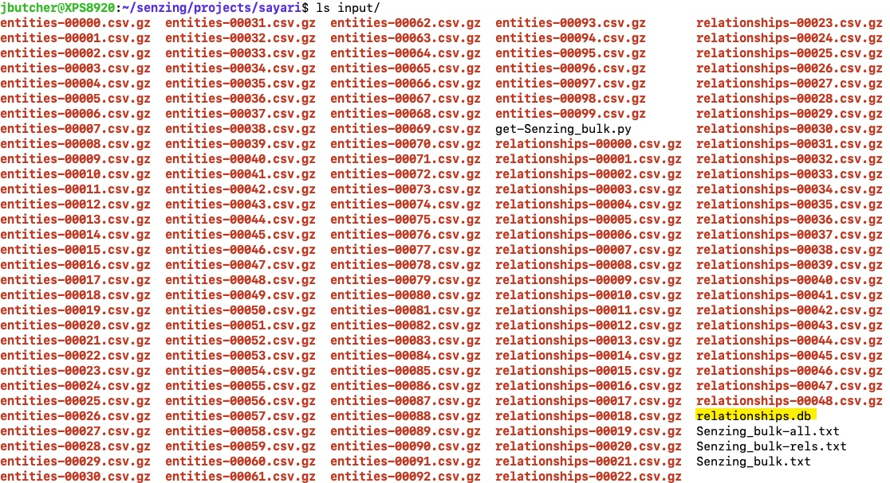
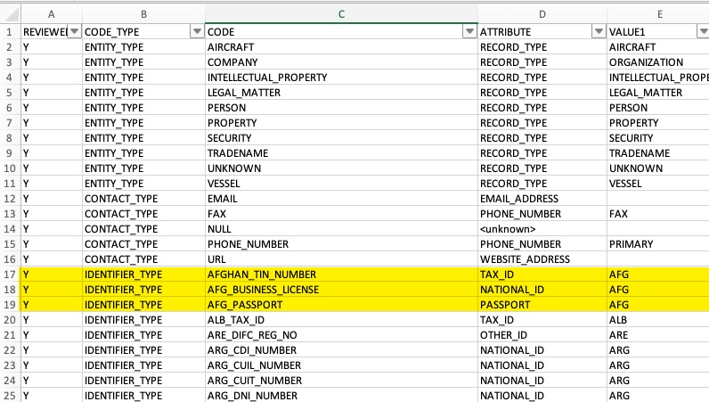
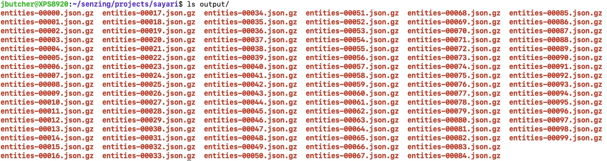

# mapper-sayari

## Overview

The [sayari_mapper.py](sayari_mapper.py) python script converts Sayari's global corporate data into JSON files ready to load into Senzing.  You can find out more about Sayari and 
how to get their data [here](https://www.sayari.com). Please note, only their CSV format is supported.

Loading this data into Senzing requires additional features and configurations. These are contained in the [sayari_config_updates.g2c](sayari_config_updates.g2c) file.

This mapper also uses a conversion table to map Sayari codes into Senzing codes.  These are contained in the [sayari_codes.csv](sayari_codes.csv) file.

## Contents

1. [Prerequisites](#prerequisites)
1. [Installation](#installation)
1. [Download Sayari files](#download-sayari-files)
1. [Code conversion table](#code-conversion-table)
1. [Running the mapper](#running-the-mapper)
1. [Configuring Senzing](#configuring-senzing)
1. [Loading into Senzing](#loading-into-senzing)

### Prerequisites

- Python 3.6 or higher
- Senzing API version 2.1 or higher
- Pandas (pip3 install pandas)

### Installation

Place the following files on a directory of your choice:

- [sayari_mapper.py](sayari_mapper.py)
- [sayari_config_updates.g2c](sayari_config_updates.g2c)
- [sayari_codes.csv](sayari_codes.csv)

### Download Sayari files

Once you purchase Sayari data, they will give access to a secure download site so you can download their files into a directory of your choice.   There will be one or more entity files
and one or more relationship files.   The mapper will ask for this directory and expects to find the string "entities" in the entity file names and the string "relationships" in the 
relationship file names.  The files will be gzipped and there is no need to uncompress them.  The mapper will read and write the gzip files to save space.



Note the highlighted relationships.db file.   It will be created when you run the mapper and is a sqlite database of all the relationships in the raw sayari files.   

### Code conversion table

The [sayari_codes.csv](sayari_codes.csv) conversion table has already been created for you. Most mappings are pretty straigtforward, but considerable work was performed
to correctly map the identifier codes as well as the weak indentifier codes into senzing.



The desciption of the Sayari codes can be found [here](https://docs.sayari.com/enums/#identifier-type-enum).  The description of the Senzing attributes can 
be found [here](https://senzing.zendesk.com/hc/en-us/articles/231925448-Generic-Entity-Specification-json-csv-Mapping).

Senzing identifier attributes include national_id, tax_id, passport, drivers_license, other, etc and have a qualifier for the issuing country whereas the Sayari identifer 
code includes the country as part of the code itself.  

Notice in the conversion table above how the Afghan identifier codes have been assigned.  The general rule applied was that if the Sayari code was not clearly a passport, drivers 
license or tax_id, it was assigned as a national_id if it was issued by the country as a unique ID for either a person or an organization.  Otherwise, it was assigned as an other_id.

These mappings can be changed if desired.  For instance, in Senzing a "national_id" has more weight than an "other_id".  Therefore, if you want to lower the strength of a 
national_id, map it as an other_id and vice versa.

### Running the mapper

```console
python3 sayari_mapper.py --help
usage: sayari_mapper.py [-h] [-i INPUT_PATH] [-o OUTPUT_PATH] [-r RELATIONDB_NAME] [-l LOG_FILE] [-x] [-D] [-U]

optional arguments:
  -h, --help            show this help message and exit
  -i INPUT_PATH, --input_path INPUT_PATH
                        the directiory that contains the sayari files
  -o OUTPUT_PATH, --output_path OUTPUT_PATH
                        the directory to write the mapped JSON files to
  -r RELATIONDB_NAME, --relationdb_name RELATIONDB_NAME
                        the relationship db file to build or use
  -l LOG_FILE, --log_file LOG_FILE
                        optional name of the statistics log file
  -x, --extended_format
                        map the all the fields including finances and other information
  -D, --debug           run in debug mode
  -U, --unattended      dont ask questions
```

Lets say you created a directory named "sayari" with an "input" and an "output" sub-directory. You would place the files from this github project on the sayari directory and download
all the Sayari files to the input directory.  

Basic use: 
```console
python3 sayari_mapper.py -i ./input -r input/relationships.db -o ./output/
```
- Specify the input and output directories with -i and -o.  A JSON output file will be created for every "entities" CSV input file.
- Specify where you want the relationships sqlite database stored.   I would suggest creating it on the input directory.
- Specify the -x flag to also map the financial and other information. These two fields aren't used for resolution, but can be added if desired.
- Specify the -U flag so that it doesn't ask for confirmations before it overwrites files which is useful if you create a script.
- Specify a log file if you want statistics such as how many names were created, addresses, national_ids, etc.  This along with the -D debug flag can useful if you plan 
to make changes to the code.

**Large data sets:**

*If you download the full data set, this process will take many hours to run and the relationships must be loaded into a sqlite database before the entities are processed.  The mapper
will take care of this for you, but following these guidelines can help improve performance.*

**Step 1: Load the relationship files first**

From the sayari directory, type: 
```console
python3 sayari_mapper.py -i "./input/relationships*" -r input/relationships.db -o ./output/
```
This will take a few hours to run on the full data set, but it only needs to be run once. 

**Step 2: Map the entities files second**

If you downloaded the full data set, there will be around 100 files with around 20m rows each!  It is best to create a script and have multiple mappers running at the same 
time.  The example script included in this project [map_entities.sh](map_entities.sh) starts 10 processes that map 10 files each and may take about 10 hours to run.

The result of this is an output directory with a gzipped JSON file for each gzipped "entities" CSV file on the input directory.  



The relationship files are no longer needed as the mapper adds the relationships to each entity as it maps them.  You will also notice that there are less records in the 
entities files than the CSV input files because they contain one or more rows per real world entity.  The mapper combines these into one record per real world entity.

### Configuring Senzing

*Note:* This only needs to be performed once and you may want to add these configuration updates to a master configuration file for all your data sources.

From your Senzing project directory:

```console
python3 G2ConfigTool.py <path-to-file>/sayari_config_updates.g2c -f
```

This will step you through the process of adding the data sources, features, attributes and other settings needed to load this data into 
Senzing. After each command you will see a status message saying "success" or "already exists". For instance, if you run the script twice, 
the second time through they will all say "already exists" which is OK.

### Loading into Senzing

The JSON files in the output directory can be loaded into Senzing in various ways.  If you have a docker or AWS setup, you can load them via the stream-producer or if you
have a bare metal install you can load them via the G2Loader python script provided in the install.

